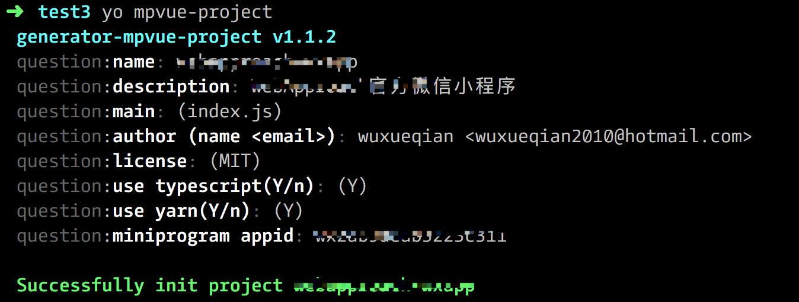
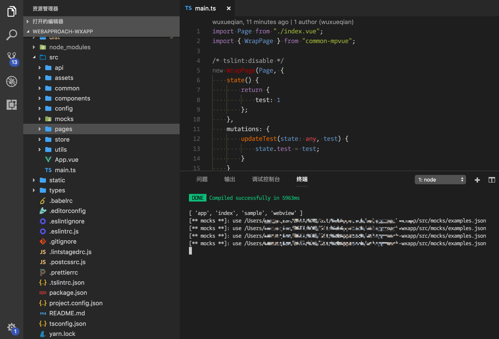
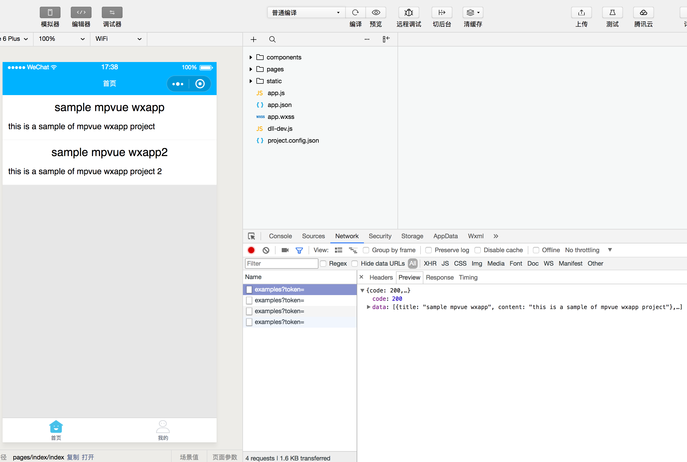

## generator-mpvue-project

A yeoman generator of helping to init your mpvue project

基于 mpvue 开发小程序项目的脚手架

*   [x] 支持 JS/TS 工程选项
*   [x] 支持 API mock 功能，开发时可选使用本地 JSON mock 数据或单独的 API 服务器数据
*   [x] 提供通用能力抽象，如 request 库，promisify 话的 wx API，token 以及业务数据持久化的 Store，emitter 跨页面通信等用户只专心写 pages 即可
*   [x] 集成众多的工程开发最佳实践: eslint/tslint 代码检查 prettier 代码格式化 lintstaged 和 pre-commit 做 git 钩子完成上述任务

## Screenshots







## Install

```
npm install yo -g
npm install generator-mpvue-project -g
```

## Usage

```
yo mpvue-project
```
